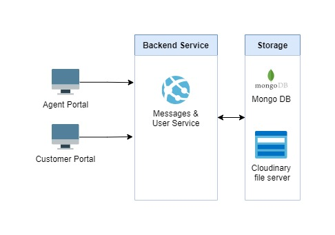

# CS Messaging App

This is a simple web application that allows customers send support messages to the company (Branch Int'l) and agents respond to the questions in real time.

## Table of Contents

-   [System Overview](#system-overview)
    -   [System Design](#system-design)
    -   [System Requirements Specification](#system-requirements-specification)
-   [Technology Stack](#technology-stack)
-   [Set Up](#set-up)
    -   [Prerequisites](#prerequisites)
    -   [Installation](#installation)
    -   [Folder Structure](#folder-structure)
    -   [Configuration](#configuration)
    -   [Running Locally](#running-locally)

### System Overview

The system uses a microservices approach. It has two front end services (agent portal and customer portal) that make api calls to the backend service. The backend service is then connected to the online database provider (mongodb atlas) and file server (cloudinary)

#### System Design

Here's an overview of the high level desing:



#### System Requirements Specification

Please refer to [this](https://docs.google.com/document/d/1B4EZ-3tVtH4VdVn6QEDu1SpvwlA7rAR1vYpUkHI17zQ/edit?usp=sharing) document to read more about the SRS of the project. Open the link in a new tab(preferrably).

### Technology Stack

This project uses the following tech stack:

**Programming Languages:** JavaScript and TypeScript

**Libararies / Frameworks:** React.js and Express.js

**Dependancies and Plugins** (highlights): bcrypt, dayjs, cors, express-async-handler, nodemon, socketio, fontawesome, flowbite-react, socket.io-client, tailwind, vite

**Database:** MongoDB

**File Storage:** cloudinary storage provider

### Set Up

#### Prerequisites

Please install the following software to set up the project locally

1. Code editor of your choice. ([VS Code](https://code.visualstudio.com/download) preferably)
2. [Node.js](https://nodejs.org/en)
3. [Postman](#https://www.postman.com/downloads/)
4. Browser of your choice ([Chrome](https://www.google.com/chrome/?brand=JJTC&gclid=CjwKCAjwnOipBhBQEiwACyGLugHK1-YG0THrsZZMIqYRt6MDiI_BMH7eS7LmEHq8PTXscAe9s_p_HBoCQN4QAvD_BwE&gclsrc=aw.ds), [Edge](https://www.microsoft.com/en-us/edge/download?form=MA13FJ), [FireFox](https://www.mozilla.org/en-US/firefox/new/))

#### Installation

1. Clone the repository from this [link](https://github.com/dedan-wamalwa/cs-messaging-app.git) to a folder of your choice in your local machine
   **Additional**: You may fork the repo to make contributions.

#### Folder Structure

    .
    ├── agent-portal            # Agent portal where agents manage incoming messages
    ├── customer portal         # Portal where customers send messages from
    ├── gitignore               # Folders/ file to ignore
    ├── package-lock.json       # Exact dependancies for the backend service
    ├── package.json            # Writeable file containing dependancies for the backend service
    └── README.md               # Guide on how to set up the project (You are reading this file at the moment)

#### Configuration

For the project to work correctly, you need to set up some environment variables. These variables may vary slightly but they will be provided upon request

1. Create a .env file in the root folder of the project. Same level as this README file.
   The following variables are required:

-   **_PORT_** #port where backend will run. 5000 is the default port
-   **_MONGO_URI_** # mongo db uri
-   **_JWT_SECRET_** # jwt secret for encrypting jwt tokens
-   **_CORS_ORIGINS_** # urls allowed to access backend service
-   **_DEFAULT_COMPANY_ID_** # a unique id for the company for use in web sockets
-   **_DEFAULT_PING_TIMEOUT_** # default timeout in ms for the client to send a pong

2. Navigate to the root folder (use the command below if you are in the projects root folder) of agent-portal and create a .env file

```cmd
cd /agent-portal
```

-   **_VITE_PUBLIC_API_HOST_** # the backend api's host
-   **_VITE_FILE_UPLOAD_URL_** # link to upload files in cloudinary
-   **_VITE_DEFAULT_PROFILE_URL_** # default profile pic url if user didn't provide one

3. Navigate to the root folder (use the command below if you are in the agent-portal root folder) of customer-portal and create a .env file

```cmd
cd ../customer-portal
```

-   **_VITE_PUBLIC_API_HOST_** # the backend api's host
-   **_VITE_FILE_UPLOAD_URL_** # link to upload files in cloudinary
-   **_VITE_DEFAULT_PROFILE_URL_** # default profile pic url if user didn't provide one

#### Running Locally

1. Running the server
    - Navigate to projects root folder and run the following commands:
    ```npm
    npm install
    ```
    ```npm
    npm start
    ```
2. Running the agent portal
    - Navigate to the agent-portal root folder and run the following commands:
    ```npm
    npm install
    ```
    ```npm
    npm run dev
    ```
3. Running the customer portal
    - Navigate to the customer-portal root folder and run the following commands:
    ```npm
    npm install
    ```
    ```npm
    npm run dev
    ```
